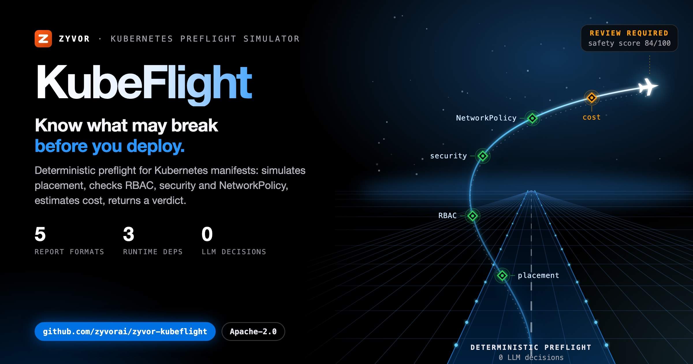
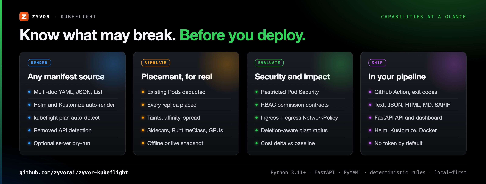
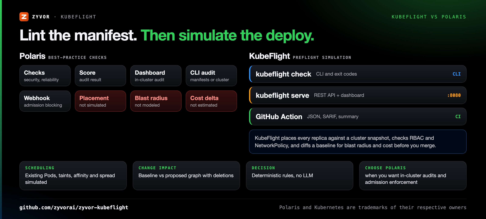
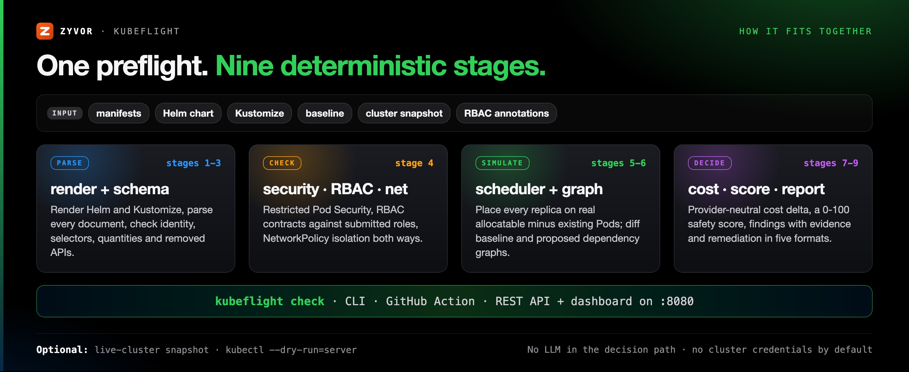

<div align="center">

# KubeFlight

[](https://github.com/zyvorai/zyvor-kubeflight/actions/workflows/ci.yml)
[](LICENSE)
[](CHANGELOG.md)
[](pyproject.toml)
[](https://zyvorai.github.io/zyvor-kubeflight/)

[](https://zyvor.dev/schedule?utm_source=github&utm_medium=kubeflight&utm_campaign=readme_hero)
[](https://zyvor.dev/poc?utm_source=github&utm_medium=kubeflight&utm_campaign=readme_hero)
[](#quickstart)



### Know what may break before you deploy.

**A deterministic Kubernetes preflight that simulates the deploy, not just the YAML.** It renders your manifests, places every replica against a cluster snapshot, evaluates security, RBAC and NetworkPolicy, diffs change impact, estimates cost and returns an evidence-backed safety decision, all locally.

**Placement simulation** · **RBAC + NetworkPolicy** · **Blast radius and cost delta** · **SARIF for GitHub** · **0 LLM decisions**

</div>

> KubeFlight is intentionally deterministic. It does not use an LLM to decide whether a deployment is safe.

---

## What's new

Version 0.2.0 ([CHANGELOG.md](CHANGELOG.md)):

| | |
|---|---|
| **Real scheduler simulation** | Existing non-terminal Pods are deducted, every replica is placed, with taints/tolerations, required affinity/anti-affinity and hard topology spread. |
| **Correct request accounting** | App, init and native-sidecar containers, RuntimeClass overhead, ephemeral storage and extended resources such as GPUs. |
| **Deletion-aware blast radius** | Baseline and proposed dependency graphs are combined, so a deleted Service keeps its former dependents. |
| **Ingress and egress NetworkPolicy** | Both directions evaluated, with selectors and ports. |
| **RBAC permission contracts** | API groups, verbs and resourceNames, checked against submitted Roles and bindings. |
| **`kubeflight plan`, Markdown and SARIF** | Auto-detects deployment roots and Helm/Kustomize renderers; the GitHub Action emits JSON, SARIF and a step summary. |
| **Safer defaults** | No service-account token mounted by default; live-cluster mode is explicit, read-only and needs bearer auth. |

---

## Why KubeFlight

A valid manifest can still fail in production because of node capacity, existing Pods, taints, affinity, NetworkPolicy, missing RBAC, removed APIs, cost growth, availability constraints, or downstream dependencies. KubeFlight puts those signals into one repeatable preflight.

| When this happens… | KubeFlight gives you… |
|---|---|
| The manifest passes lint and the Pods sit in `Pending` | **Placement simulation** on real allocatable minus existing Pods, with taints, affinity and topology spread |
| A deploy needs permissions nobody wrote down | **RBAC contracts** in an annotation, evaluated against the Roles and bindings you submit |
| A new NetworkPolicy silently cuts off a dependency | **Ingress and egress NetworkPolicy isolation** against statically inferred Service dependencies |
| Deleting a Service breaks something three hops away | **Deletion-aware blast radius** across baseline and proposed dependency graphs |
| A change quietly doubles the requests bill | **Provider-neutral cost delta** against the baseline, with rates you calibrate |
| Reviewers want proof, not a vibe | **Evidence and remediation with every finding**, a 0-100 score, and text, JSON, HTML, Markdown or SARIF reports |



---

## KubeFlight vs Polaris



| | **KubeFlight** | **Polaris** |
|---|---|---|
| Primary job | Preflight simulation with an evidence-backed decision | Best-practice checks on workload configuration |
| Security checks | Restricted Pod Security, including Windows HostProcess, SELinux, AppArmor and probe hosts | Built-in security checks plus custom checks |
| Scheduling | Places every replica against an offline or live cluster snapshot | Not simulated |
| RBAC | Permission contracts evaluated against submitted Roles and bindings | Not a focus |
| Change impact | Baseline vs proposed diff, dependency graph, deletion-aware blast radius | Not modeled |
| Cost | Provider-neutral request and storage estimate, baseline delta | Not estimated |
| Where it runs | CLI, GitHub Action (SARIF), REST API and dashboard; no cluster needed | Dashboard, CLI audit, admission webhook |
| **Choose Polaris when** | | You want continuous in-cluster audits and admission-time enforcement of best practices |

KubeFlight is a preflight simulator, not an admission controller; run it in CI before the cluster ever sees the change.

### Is this for you?

KubeFlight is a small, open-source (Apache-2.0), local-first, deterministic preflight simulator — it's not a cost-monitoring dashboard, not a general-purpose policy engine, and not an AI-assisted deployment advisor.

| | **KubeFlight** | Datree / Fairwinds Insights | Polaris / kube-score | OPA/Conftest, Kyverno | k8sgpt | `kubectl diff --dry-run=server` |
|---|---|---|---|---|---|---|
| Primary scope | Preflight simulation: placement, RBAC, NetworkPolicy, cost delta, evidence-backed decision | Policy/config scanning + fleet dashboard (some proprietary) | Static manifest best-practice linting | Generic policy-as-code enforcement | LLM-based cluster diagnosis | Server-side dry-run diff only, no scoring |
| Decision method | Deterministic — "does not use an LLM to decide whether a deployment is safe" | Deterministic rules | Deterministic rules | Deterministic rules you author | LLM-based (probabilistic) | N/A (raw diff) |
| Placement/scheduling simulation | Yes, against an offline or live cluster snapshot | No | No | No | No | No |
| Cost estimation | Yes (provider-neutral) | Some (Fairwinds/Kubecost-adjacent tools) | No | No | No | No |
| License | Apache-2.0 | Mixed open-core/proprietary | Apache-2.0 | Apache-2.0 | Apache-2.0 | N/A (built into kubectl) |

*(General characterizations as of writing — verify current features against each project's own docs.)*

---

## See it live


*The embedded dashboard (`kubeflight serve`): the demo preflight scores 84/100, review required, with every finding explained.* A sample rendered report: [docs/demo-report.html](docs/demo-report.html).

---

## How it fits together



KubeFlight is a deterministic preflight pipeline ([docs/ARCHITECTURE.md](docs/ARCHITECTURE.md)):

`input -> render/parse -> structural/schema checks -> security/RBAC/network -> scheduler simulation -> change graph -> cost -> scoring -> reports`

**Design principles**: deterministic first · evidence and remediation with every finding · local-first, no SaaS dependency · no cluster credentials in the default deployment · unknown is not the same as safe or blocked · server dry-run/admission remains authoritative when enabled · simulation limitations are part of the output contract.

---

## Quickstart

Requires **Python 3.11+**.

```bash
python -m venv .venv && source .venv/bin/activate
pip install -e .

kubeflight check examples/demo/app.yaml \
  --baseline examples/demo/baseline.yaml \
  --cluster-snapshot examples/demo/cluster-snapshot.json \
  --fail-on never
```

Or auto-detect a conventional Kubernetes/Helm/Kustomize path:

```bash
kubeflight plan
```

Reports: `kubeflight check <path> --format json|html|markdown|sarif --output <file>`. Optional authoritative validation: `kubeflight check <path> --server-dry-run` shells out to `kubectl apply --dry-run=server` against a configured cluster.

New here? [`docs/FAQ.md`](docs/FAQ.md) covers licensing, support, and production-readiness questions; [`docs/TROUBLESHOOTING.md`](docs/TROUBLESHOOTING.md) covers real operational issues with their documented fix.

### Dashboard

```bash
kubeflight serve --host 0.0.0.0 --port 8080   # http://localhost:8080, API docs at /api/docs
```

The browser sends manifests only to the KubeFlight instance you opened — no external SaaS or AI call. Do not send Secrets to an untrusted/shared deployment.

### Kubernetes

Default mode mounts **no service-account token** and grants no cluster-wide RBAC:

```bash
kubectl apply -k deploy/kubernetes
kubectl -n kubeflight rollout status deployment/kubeflight
```

Helm: `helm upgrade --install kubeflight charts/kubeflight --namespace kubeflight --create-namespace`. Docker: `docker run --rm -p 8080:8080 --read-only --cap-drop ALL kubeflight:local`. Both default to the same no-token, no-cluster-wide-RBAC posture; exposure and Pod Security details are in [`docs/DEPLOYMENT.md`](docs/DEPLOYMENT.md).

### Opt-in live-cluster snapshot mode

```bash
kubectl -n kubeflight create secret generic kubeflight-api \
  --from-literal=token='replace-with-a-long-random-token'
kubectl apply -k deploy/kubernetes/live-cluster
```

Grants read-only `get/list` for Nodes, Namespaces, Pods, ServiceAccounts, StorageClasses and RuntimeClasses only — never Secrets, logs, exec, or writes. Clients authenticate to `/api/check` with `Authorization: Bearer <token>`.

### Remote deploy

Cross-ships source and installs KubeFlight as a systemd service over SSH:

```bash
./scripts/deploy-remote.sh <host> <user> --port 27754   # or KUBEFLIGHT_PORT=27754, or omit to reuse .deploy-last
./scripts/smoke-remote.sh --port 27754                  # or KUBEFLIGHT_URL=...
./scripts/deploy-remote.sh <host> <user> --uninstall     # remove
```

## What ships

- **RBAC contracts** — annotate a manifest (`kubeflight.io/requires-rbac: |` with a YAML list of `apiGroup`/`resource`/`verbs`/`resourceNames`) and KubeFlight evaluates it against submitted Roles/ClusterRoles/RoleBindings/ClusterRoleBindings.
- **GitHub Action** — `uses: zyvorai/kubeflight@v0.2.0` with `path`/`baseline`/`fail-on` inputs, a JSON/SARIF/Markdown output triple, and a step-summary write; exit codes `0` (pass), `2` (input error), `3` (threshold crossed), `4` (dry-run failed).
- **Cost model** — normalized reference rates you calibrate (`KUBEFLIGHT_COST_CPU_MONTH`, `_GIB_MONTH`, `_GIB_STORAGE_MONTH`, `_GPU_MONTH`), not a cloud bill forecast.
- **API security** — `KUBEFLIGHT_API_TOKEN`, `KUBEFLIGHT_LIVE_CLUSTER` (default `false`), body/concurrency/rate-limit guards (`KUBEFLIGHT_MAX_BODY_BYTES`, `_MAX_CONCURRENT`, `_RATE_PER_MINUTE`); live-cluster requests require both a token and the flag.
- **Offline cluster snapshot** — a JSON document of `nodes`/`pods`/`namespaces`/`serviceaccounts`/`storageclasses`/`runtimeclasses`; existing non-terminal Pods are deducted from allocatable resources before proposed replicas are placed.
- **Release checks** — `./scripts/release_check.sh` runs compile, tests, API smoke, Kubernetes self-analysis, YAML validation, and wheel build/install smoke locally; CI adds Helm, Kustomize, Docker and kind checks.

## Project layout

```text
kubeflight/
├── kubeflight/             # parser, deterministic engine, API, CLI, embedded UI
├── tests/                  # unit/API/CLI + v0.2 regression tests
├── examples/               # demo + intentionally unsafe manifests
├── deploy/kubernetes/      # restricted default install + opt-in live overlay
├── charts/kubeflight/      # Helm chart
├── scripts/                # smoke/self-analysis/release checks
├── docs/                   # architecture, rules, deployment, threat model
├── action.yml              # GitHub composite action
└── .github/workflows/      # CI, kind E2E, release/SBOM/provenance
```


## Docs map

| Topic | Doc |
| --- | --- |
| Architecture, pipeline stages, trust boundaries | [`docs/ARCHITECTURE.md`](docs/ARCHITECTURE.md) |
| Severities and what triggers each | [`docs/RULES.md`](docs/RULES.md) |
| Deployment modes, exposure, Pod Security | [`docs/DEPLOYMENT.md`](docs/DEPLOYMENT.md) |
| Assets, defaults, non-goals | [`docs/THREAT_MODEL.md`](docs/THREAT_MODEL.md) |
| Licensing, support, production-readiness | [`docs/FAQ.md`](docs/FAQ.md) |
| Real issues with their documented fix | [`docs/TROUBLESHOOTING.md`](docs/TROUBLESHOOTING.md) |
| Rendered documentation site | <https://zyvorai.github.io/zyvor-kubeflight/> |


## v0.2.0 capabilities

| Area | Checks |
| --- | --- |
| Parsing/rendering | multi-document YAML/JSON, Kubernetes `List`, Helm auto-render, Kustomize auto-render, repo path auto-detection |
| Schema baseline | object identity, structural checks, selector/template consistency, removed APIs; optional authoritative `kubectl --dry-run=server` |
| Quantities | Kubernetes-style DecimalSI/BinarySI/scientific quantities; invalid quantities fail closed instead of becoming zero |
| Restricted security | host namespaces, hostPath, privileged, capabilities, seccomp, non-root/UID 0, SELinux, AppArmor, Windows HostProcess, probe/lifecycle host fields |
| Scheduling | existing Pod reservations, every replica, app/init/native-sidecar accounting, RuntimeClass overhead, GPU/extended resources, taints/tolerations, required affinity/anti-affinity, hard topology spread |
| Reliability | requests/limits, readiness/liveness, PDB coverage, image pinning |
| Network | statically inferred Service dependencies, ingress + egress NetworkPolicy isolation |
| RBAC | ServiceAccount presence plus explicit API group/resource/subresource/verb/resourceName contracts via annotation |
| Change impact | baseline/proposed resource diff, dependency graphs, deletion-aware reverse blast radius |
| Cost | provider-neutral request/storage estimate and baseline delta |
| Reports | text, JSON, HTML, Markdown/PR summary, SARIF |
| API/UI | FastAPI REST API, OpenAPI docs, embedded dashboard, request-size/concurrency/rate guards, optional bearer auth |
| Kubernetes | hardened raw manifests, Kustomize, Helm, opt-in live-cluster RBAC, restricted Pod Security namespace |
| GitHub | composite Action, SARIF upload, Helm/Kustomize checks, container build, kind E2E, multi-arch release |

## Security

See [`SECURITY.md`](SECURITY.md) and [`docs/THREAT_MODEL.md`](docs/THREAT_MODEL.md) for the asset/trust model and vulnerability reporting.

## Contributing

Build/test commands and PR expectations are in [`CONTRIBUTING.md`](CONTRIBUTING.md); community conduct in [`CODE_OF_CONDUCT.md`](CODE_OF_CONDUCT.md). Release history: [`CHANGELOG.md`](CHANGELOG.md).

---

## Maturity

**Maturity, stated honestly**: current version is 0.2.0 ([`CHANGELOG.md`](CHANGELOG.md)). KubeFlight is a **preflight simulator**, not a byte-for-byte implementation of kube-scheduler plugins, admission webhooks, CNI dataplanes, or production traffic. Unknown facts are reported conservatively rather than invented. For an authoritative check beyond simulation, it explicitly defers to `kubectl apply --dry-run=server` as an opt-in feature requiring a real cluster.

Release validation ([`TEST_RESULTS.md`](TEST_RESULTS.md)): 35/35 unit/API/CLI/regression tests pass, a demo preflight scores 84/100 (review required — the demo manifest is intentionally imperfect), and KubeFlight's own Kubernetes deployment self-analyzes at 100/100 with zero high/critical findings.

---

## Part of the Zyvor stack

| Product | Role next to KubeFlight |
|---|---|
| **KubeFlight** | Deterministic Kubernetes preflight: before the deploy |
| **[Netra](https://github.com/zyvorai/zyvor-netra)** | Pairs with KubeFlight after the deploy: eBPF network observability and emergency control on any CNI |
| **[Paqtra](https://github.com/zyvorai/zyvor-paqtra)** | Pairs with KubeFlight on Cilium clusters: Hubble flow tracing, drop explanations and policy preview |
| **[Argus](https://github.com/zyvorai/zyvorai-argus)** | Next to KubeFlight in the pipeline: generated Playwright tests that run on every deploy |

→ [zyvor.dev](https://zyvor.dev)

---

## License

KubeFlight is **free and open source** under the [Apache License 2.0](LICENSE) (see [NOTICE](NOTICE)): use, modify and run it for personal, lab and commercial production use at no charge. That does not change.

**Zyvor Enterprise** adds what production teams ask for: supported releases, deployment and upgrade guidance, priority incident triage, a named technical contact and 24x7 critical intake. Plans and terms: [docs/SUBSCRIPTION-MODEL.md](docs/SUBSCRIPTION-MODEL.md) · [Pricing](https://zyvor.dev/pricing?utm_source=github&utm_medium=kubeflight&utm_campaign=readme_license) · [sales@zyvor.dev](mailto:sales@zyvor.dev).

---

<div align="center">

### Make every deploy a preflight

[](https://zyvor.dev/schedule?utm_source=github&utm_medium=kubeflight&utm_campaign=readme_footer)
[](https://zyvor.dev/poc?utm_source=github&utm_medium=kubeflight&utm_campaign=readme_footer)
[](https://zyvor.dev/pricing?utm_source=github&utm_medium=kubeflight&utm_campaign=readme_footer)
[](mailto:sales@zyvor.dev?subject=KubeFlight)
[](https://github.com/zyvorai/zyvor-kubeflight)

</div>
